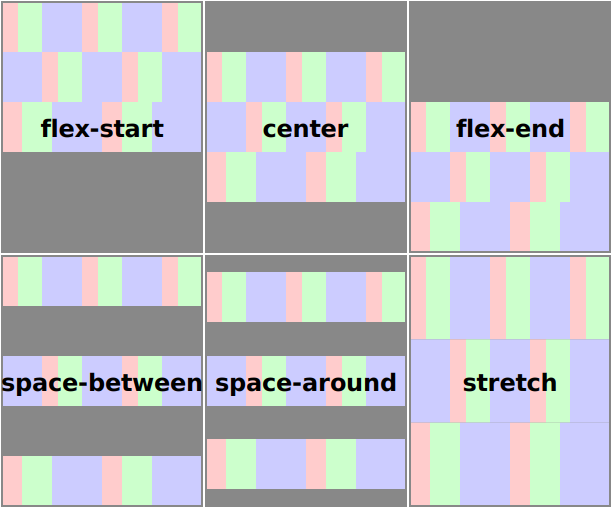

# Flexbox

CSS 2 布局模式：block, inline, table, positioned。

flexbox 是一种新的布局模式。



## Terminology


flexbox 相关属性比较多，首先应分清该属性是用于 flex container 还是 flex items。

## flex container

### display

```
display: flex | inline-flex
```

将 element 声明为 flex container，它的 chidren 为 flex items。

### flex-direction

```
Value: row | row-reverse | column | column-reverse
```

指定主轴方向。

初始值为 row，表示与书写方向一致。

### flex-wrap

```
Value: nowrap | wrap | wrap-reverse
```

是否可以换行。

初始值为 nowrap，表示不可换行。

### flex-flow

```
Value: <flex-direction> || <flex-wrap>
Initial: row nowrap
```

这是一个 shorthand property。

### justify-content

```
Value: flex-start | flex-end | center | space-between | space-around
Initial: flex-start
```

flex items 在主轴的排列。


### align-items

```
Value: flex-start | flex-end | center | baseline | stretch
Initial: stretch
```

flex items 在交叉轴的排列。

flex items 可以用 [align-items](#align-items) 覆盖这个属性。


### align-content

```
Value: flex-start | flex-end | center | space-between | space-around | stretch
Initial: stretch
```

flex lines 的排列。只有当 flex container 多行时（flex-wrap: !nowrap）才有效果。




## flex items

flex items

- 忽略 float
- margin: auto，在 justify-content, align-self 之前取走空余空间。

### flex

```
Value: none | flex-grow flex-shrink flex-basis
Initial: 0 1 auto
```

这是一个 shorthand property。

property    | omitted | initial
----------  | :-----: | :-----:
flex-grow   | 1       | 0
flex-shrink | 1       | 1
flex-basis  | 0       | auto

omitted 的意思是在 flex 中没有指定。

flex 的值可以是这些关键字

keyword  | value    | description
-------  | -------- | ------------
initial  | 0 1 auto | 不能扩张但可以收缩
auto     | 1 1 auto | 可以扩张也可以收缩
none     | 0 0 auto | 不能扩张也不能收缩
n        | n 1 0    | n 是 `<positive-number>`


### flex-grow

```
Value: <number>
Initial: 0
```

### flex-shrink

```
Value: <number>
Initial: 1
```

### flex-basis

```
Value: content | <width>
Initial: auto
```


### align-self

覆盖 flex container 的 [align-items](#align-items)。

### order

```
Value: <integer>
Initial: 0
```

指定 flex items 的排列次序。值小的排在前面，值一样的按文档的次序排列。

`order: -1` 将 item 提到最前。

### Absolutely-Positioned Flex Children

absolutely-positioned flex item（以下简称 child）不在 flow 中，故不参与 flex layout，即可用空间的计算不考虑它。

child 就像唯一的 flex item, flex container 的 justify-content
, align-items 对它有效。

child 视为尺寸固定，所以

- `margin： auto` 计算值为 0。
- align-items 或 align-self，stretch 视为 flex-start。

示例

- [Chrome samples](https://googlechrome.github.io/samples/css-flexbox-abspos/index.html)

## 资料

- [Spec](https://drafts.csswg.org/css-flexbox/)
- [flexbox bugs](http://philipwalton.com/articles/normalizing-cross-browser-flexbox-bugs/)
