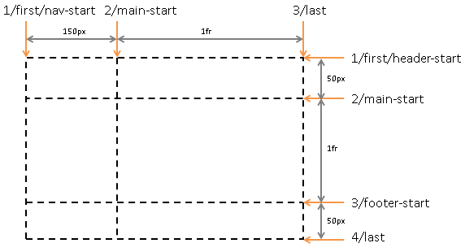

# CSS Grid Layout

Flexbox 在一个维度（one dimension）布局，Grid 可以在两个维度（two dimensions）布局。

Grid layout 和 table layout 类似，不过 table layout 通常只用于 `<table>`，功能有限。



## Terminology

```
display: grid | inline-grid
```

将 element 声明为 grid container，它的 in-flow child 为 grid items。


- grid line
- grid track，是 grid 的 row/column
- grid cell
- grid area，是一个或数个 grid cells

grid container 用相关属性定义一个 grid，grid cells 用相关属性把它放到一个 grid area 内。

## grid container

grid container 为它的 contents 创建一个 grid formatting context。
和 block formatting context 类似，container 不会和它的 contents 合并 margin。

grid container 不是 block container，忽略 float, clear, vertical-align。

<table class="text-center">
  <tr>
    <td rowspan="2">shorthands</td>
    <td colspan="2">grid</td>
  </tr>
  <tr>
    <td>grid-template</td>
    <td></td>
  </tr>
  <tr>
    <td>longhands</td>
    <td class="text-left">
      这三个属性设置 explicit grid tracks
      <br> grid-template-rows
      <br> grid-template-columns
      <br> grid-template-areas
    </td>
    <td class="text-left">
      这三个属性设置 implicit grid tracks
      <br> grid-auto-rows
      <br> grid-auto-columns
      <br> grid-auto-flow
    </td>
  </tr>
</table>

### grid-template-rows, grid-template-columns

定义 grid 的 rows/columns 尺寸和 grid lines 的名字。

```
Value: none | <track-list> | <auto-track-list>
```

第一种为 `none`，也是初始值。

第二种

```css
.container {
  grid-template-rows: 150px auto 100px;
  grid-template-columns: minmax(200px, 3fr) 9fr;
}
```

第三种，为 lines 指定名字

```css
.container {
  display: grid;
  grid-template-columns: [first nav-start] 150px [main-start] 1fr [last];
  grid-template-rows: [first header-start] 50px [main-start] 1fr [footer-start] 50px [last];
}
```



size

- `<length-percentage>`
- auto
- max-content
- min-content
- minmax(min, max) 指定一个 range [min, max]
- `fit-content( <length-percentage> )`

#### `fr`

`fr` 是 flexible length（`<flex>`） 的单位，表示 grid container 剩余空间的因子（系数）。

`<flex>` 不是 `<length>`，不能用于 `calc()` 等表达式。

使用了 `fr` 的 tracks 称为 flexible tracks。

#### `repeat()`

如果 track list 一部分重复出现，可以用 `repeat()`。

```css
.container {
  grid-template-columns: 10px [col-start] 250px [col-end]
                         10px [col-start] 250px [col-end]
                         10px [col-start] 250px [col-end]
                         10px [col-start] 250px [col-end] 10px;
  /* 改用 repeat() */
  grid-template-columns: repeat(4, 10px [col-start] 250px [col-end]) 10px;
}
```

`repeat()` 有两个参数，第二个参数是 track list，第一个参数

- integer，表示重复次数
- auto-fill
- auto-fit

### grid-template-areas

为 grid areas 指定名字。名字用于 grid placement properties。

```
Value: none | <string>+
```

属性值也是 grid 结构的图示

```css
.container {
  grid-template-areas:
    "header header header header"
    "main main . sidebar"
    "footer footer footer footer";
}
```

- 重复的名字表示 span cells
- `.` 表示 empty cell。`.` 可以重复，比如 `...`，以方便对齐。

每行必须有相同数量的 cells，不然无效。

自动为 grid lines 命名。 比如 area 的名字为 "foo"，四条线的名字

```
 foo-start      foo-end
 |              |
 |              |
-------------------- foo-start
 |              |
 |     foo      |
 |              |
-------------------- foo-end
 |              |
 |              |
```

对于相邻的 areas，它们的交叉线就会有多个名字。


### grid-template

grid-template 设置 grid-template-rows, grid-template-columns, grid-template-areas

第一种为 `none`，将这三个属性设为它们的初始值 `none`。

第二种为 `grid-template-rows / grid-template-columns`

```css
.container {
  grid-template: auto 1fr / auto 1fr auto;
  /* 即 */
  grid-template-rows: auto 1fr;
  grid-template-columns: auto 1fr auto;
  grid-template-areas: none;
}
```

第三种

```css
.container {
  grid-template:
    [header-top] "a  a  a" [header-bottom]
    [main-top]   "b  b  b" 1fr [main-bottom]
    / auto 1fr auto;

  /* 即 */
  grid-template-areas: "a a a"
                       "b b b";
  grid-template-rows: [header-top] auto [header-bottom main-top] 1fr [main-bottom];
  grid-template-columns: auto 1fr auto;
}
```


### grid-auto-rows, grid-auto-columns

```
Value: none | <track-size>
```


### grid-auto-flow

```
Value:  [ row | column ] || dense
Initial:  row
```

值分为两部分

- row/column，缺省为 row
- sparse/dense，缺省为 sparse(不指定 dense 即代表 sparse)

```
row
column
dense // 即 row dense
row dense
column dense
```

### grid

grid 设置上面提到的 6 个 longhands。

### Gutters

Gutters 是 rows/columns 之间的空槽

row-gap, column-gap

```
Value: normal | <length-percentage>
```

```
gap: <row-gap> <column-gap>?
```

若省略 column-gap，它的值跟 row-gap 相同。


提示： 这几个属性通用于 flexbox, grid, multicol


### Alignment

grid items 在 inline/row axis 上的排列，container 用 justify-items 指定;
items 可以用 justify-self 覆盖。

grid items 在 block/column axis 上的排列，container 用 align-items 指定;
items 可以用 align-self 覆盖。


## Grid Items

### grid placement properties

<table class="text-center">
  <tr>
    <td rowspan="2">shorthands</td>
    <td colspan="4">grid-area</td>
    <td class="text-left"><code>&lt;grid-line&gt; [ / &lt;grid-line&gt; ]{0,3}</code></td>
  </tr>
  <tr>
    <td colspan="2">grid-row</td>
    <td colspan="2">grid-column</td>
    <td class="text-left"><code>&lt;grid-line&gt; [ / &lt;grid-line&gt; ]?</code></td>
  </tr>
  <tr>
    <td>longhands</td>
    <td>grid-row-start</td>
    <td>grid-row-end</td>
    <td>grid-column-start</td>
    <td>grid-column-end</td>
    <td class="text-left"><code>&lt;grid-line&gt;</code></td>
  </tr>
</table>

上表最后一列是属性值的形式。

```
grid-row: grid-row-start / grid-row-end
grid-column: grid-column-start / grid-column-end
Value: <grid-line> [ / <grid-line> ]?
```

当省略第二个 `<grid-line>` 时，若第一个 `<grid-line>` 为 `<custom-ident>`，则它取相同的值；不然为 auto。


```
grid-area： grid-row-start / grid-column-start / grid-row-end / grid-column-end
Value: <grid-line> [ / <grid-line> ]{0,3}
```

##### `<grid-line>`

第一种 `auto` 是初始值。

第二种 `<custom-ident>` 是 grid area 的名字。
grid area 的名字见上面 grid-template-areas 属性。

```css
.item {
  /* 将该 grid item 放到名为 "main" 的 grid area 内 */
  grid-area: main;
}
```

名字不能是 "span"，它有特殊作用，见下文。

第三种 `<integer> && <custom-ident>?`

整数 n，表示第 n 条 grid line。
n 从 1 开始; 为负整数时表示从后向前数。
n 为 0 则这个 declaration 无效。

当指定名字 `<custom-ident>` 时，只计数有此名字的 lines。
若总量不足，将 implicit grid lines 加入计数。

```css
.item {
  /* 将该 grid item 放到 (2, 3) 内 */
  grid-area: 2 / 3;
}

.item {
  /* 横跨整行 */
  grid-column: 1 / -1;
}
```

第四种 `span && [ <integer> || <custom-ident> ]`，指定横跨

```css
.item {
  /* 在第 7 行结束，向上跨过 5 行，从第 2 行开始 */
  grid-row: span 5 / 7;
}

.item {
  /* 在第 7 行结束，向上跨过 5 行，从第 2 行开始 */
  grid-row: span 5 / 7;
}
```

### order

同 [flex items](../flexbox/#order)

### margin

grid areas 创建 containing block context, 故毗邻 grid items 不会 collapse margin。

`margin: auto` 可以用于排列

- 在计算 grid track 尺寸时，auto 视为 0。
- 在其它 alignment 之前取走空余空间

### z-index

z-index 不是 `auto` 时创建一个 stacking context，就好像 items 指定了 `position: relative`。

### 绝对定位 grid items

绝对定位 grid items 不在 flow 中，不参与 grid layout（不占用 grid 空间，不影响 grid 尺寸计算）


## 兼容性

- [Caniuse](http://caniuse.com/#feat=css-grid)


## 资料

- [Specification](https://drafts.csswg.org/css-grid/)
- [CSS Grid – Table layout is back. Be there and be square - Google Developers](https://developers.google.com/web/updates/2017/01/css-grid)
- [Grid by Example](https://gridbyexample.com/)
- [A Complete Guide to Grid - CSS-Tricks](https://css-tricks.com/snippets/css/complete-guide-grid/)
